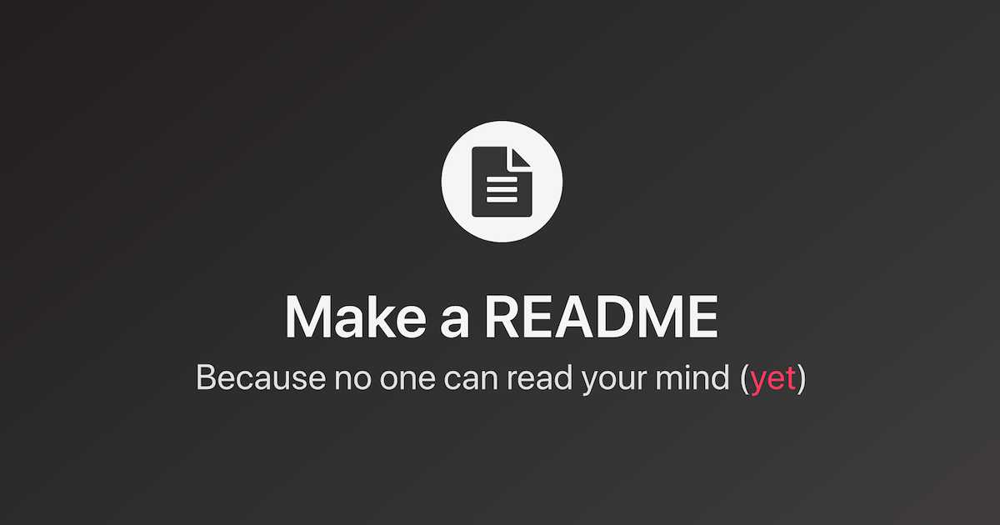

<h1 align="center">
  
</h1>

<h3 align="center" >
  You can put a description for your application here
</h3>

<p align="center">
  <a href="https://github.com/miguelsoliv">
    
  </a>
  
</p>

<p align="center">
  <a href="medal-sports-badges">Badges</a>&nbsp;|&nbsp;
  <a href="#sparkles-icons-in-badges">Putting icons in badges</a>&nbsp;|&nbsp;
  <a href="#markdown-another-reference-type">Markdown</a>&nbsp;|&nbsp;
  <a href="#mag-emojis">Emojis</a>&nbsp;|&nbsp;
  <a href="#memo-license">License</a>
</p>

## :pushpin: Another Table of Contents

* [Putting icons in badges](#sparkles-icons-in-badges)
* [Markdown](#markdown-another-reference-type)
    - [Collapsible Section](#markdown-collapsible-section)
* [Emojis](#mag-emojis)
* [License](#memo-license)

## :medal_sports: Badges

Using <a href="https://shields.io">Shields.io</a> with github integration [<a href="https://github.com/badges/shields">Github page</a>]

<p align="center">
  
  <a href="https://github.com/miguelsoliv/readme-helper/commits/master">
    
  </a>
   <a href="https://github.com/miguelsoliv/readme-helper/issues">
    
  </a>
  
</p>

###### If "Repo not found" error shows up: it's because your repo is private! No worries

## :sparkles: Icons in badges

Using [Simple Icons](https://simpleicons.org) [[Github page](https://github.com/simple-icons/simple-icons)]

<p align="center">
  <a href="https://github.com/miguelsoliv">
    
  </a>
  <a href="https://www.linkedin.com/in/miguelsoliv">
    
  </a>
  <a href="mailto:miguelosoares1@hotmail.com">
    
  </a>
</p>

## :scroll: <a id="markdown-another-reference-type">Markdown</a>

You can click [here](https://github.com/adam-p/markdown-here/wiki/Markdown-Cheatsheet) for a quick reference on Markdown!

* <strong><a id="markdown-collapsible-section">Collapsible section</a></strong>: Based on [this gist](https://gist.github.com/pierrejoubert73/902cc94d79424356a8d20be2b382e1ab)

<details>
  <summary>Click me</summary>
  
  ## You can put
  1. Anything here
  2. Even a list
     * Or nested lists
     - `a code` or
  ```
  a code block
  ```
</details>

## :mag: Emojis

Just put them between `:` like `:cookie:` :cookie:

List of emojis available in Github Markdown:

- Easy to find lists (created by users):
   - [Dellos7 list](https://github-emoji-list.herokuapp.com)
   - [Awes0meM4n list](https://awes0mem4n.github.io/emojis-github.html)
- [Github Gist](https://gist.github.com/rxaviers/7360908) from rxaviers (user)
- [Github Gist](https://gist.github.com/ricealexander/ae8b8cddc3939d6ba212f953701f53e6) from ricealexander (user)
- [Github API](https://api.github.com/emojis)

## :memo: License

This project is under [MIT license](/LICENSE).

---

Made with :sparkling_heart: by [Miguel Oliveira](https://github.com/miguelsoliv) :wave:
